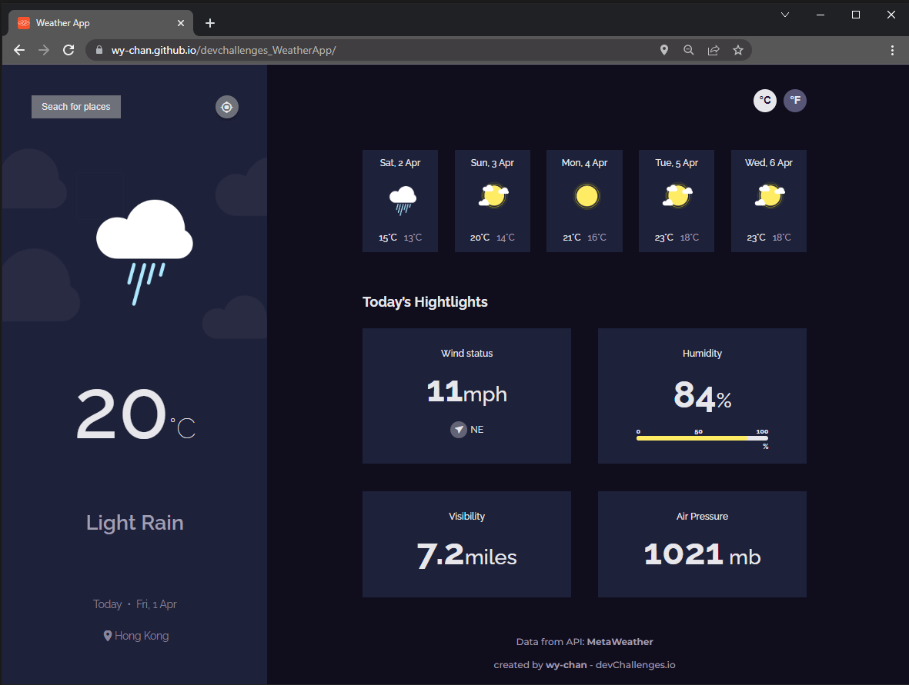
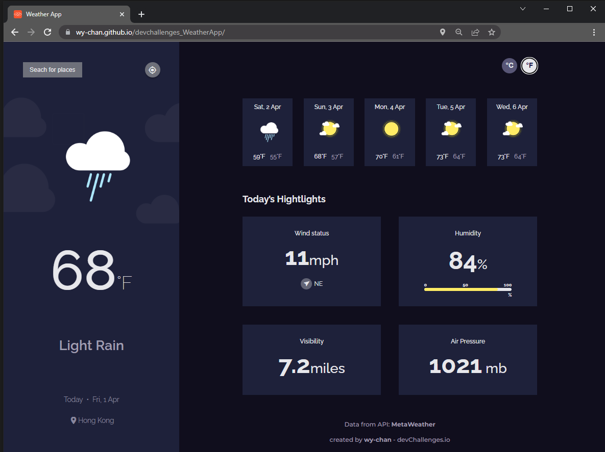
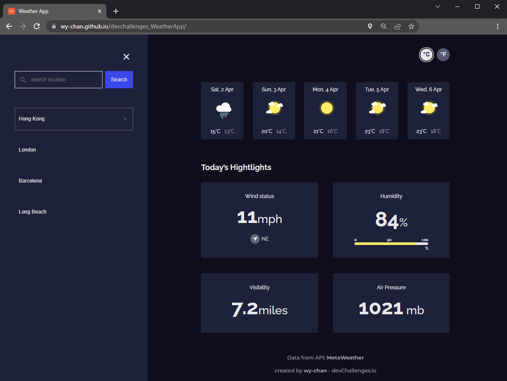
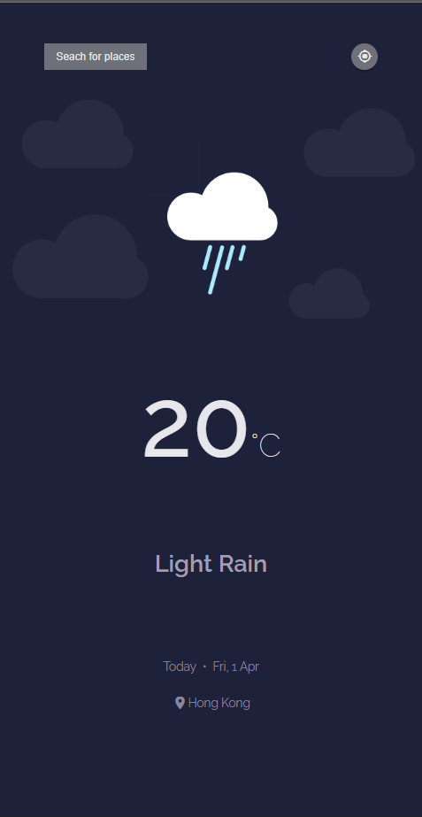
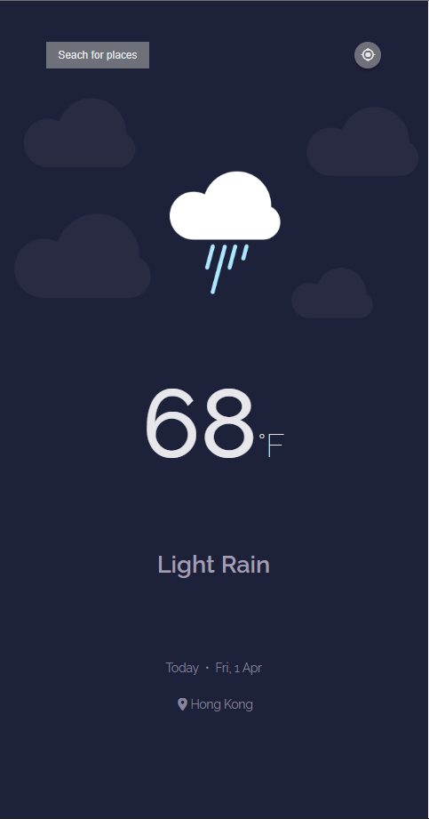
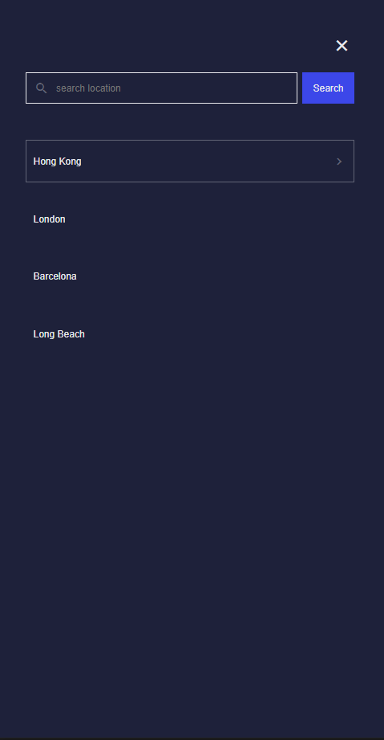
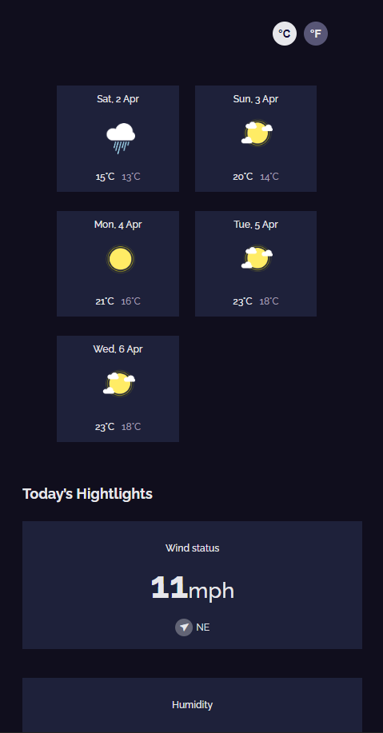
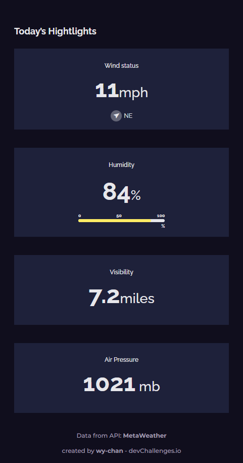

<!-- Please update value in the {}  -->

<h1 align="center" id="button">Weather App</h1>

   Solution for a challenge from  <a href="http://devchallenges.io" target="_blank">Devchallenges.io</a>.

  <h3>
    <a href="https://wy-chan.github.io/devchallenges_WeatherApp">
      Demo
    </a>
     | 
    <a href="https://github.com/wy-chan/devchallenges_WeatherApp">
      Solution
    </a>
     | 
    <a href="https://devchallenges.io/challenges/mM1UIenRhK808W8qmLWv">
      Challenge
    </a>
  </h3>

<!-- TABLE OF CONTENTS -->

## Table of Contents

- [Overview](#overview)
  - [Built With](#built-with)
- [Features](#features)
- [How to use](#how-to-use)
- [Contact](#contact)
- [Acknowledgements](#acknowledgements)

<!-- OVERVIEW -->

## Overview

   
   

   &nbsp;&nbsp;
   

   

   &nbsp;&nbsp;
   

   

   &nbsp;&nbsp;&nbsp;&nbsp;
   

   

See demo here: https://wy-chan.github.io/devchallenges_WeatherApp/

Challenge: Create a weather app using an API.

### Built With

- HTML
- CSS
- JavaScript
- [React](reactjs.org)

## Features

<!-- List the features of your application or follow the template. Don't share the figma file here :) -->

This application/site was created as a submission to a [DevChallenges](https://devchallenges.io/challenges) challenge. The [challenge](https://devchallenges.io/challenges/mM1UIenRhK808W8qmLWv) was to build an application to complete the following user stories:

- [x] I can see city weather as default, preferably my current location
- [x] User story: I can search for city
- [x] User story: I can see weather of today and the next 5 days
- [x] User story: I can see the date and location of the weather
- [x] User story: I can see according to image for each type of weather
- [x] User story: I can see the min and max degree each day
- [x] User story: I can see wind status and wind direction
- [x] User story: I can see humidity percentage
- [x] User story: I can see a visibility indicator
- [x] User story: I can see the air pressure number
- [x] User story(optional): I can request my current location weather
- [x] User story(optional): I can convert temperature in Celcius to Fahrenheit and vice versa

## Acknowledgements

<!-- This section should list any articles or add-ons/plugins that helps you to complete the project. This is optional but it will help you in the future. For example -->
#### Basics:
- [Steps to replicate a design with only HTML and CSS](https://devchallenges-blogs.web.app/how-to-replicate-design/)
- [Marked - a markdown parser](https://github.com/chjj/marked)

#### Fonts & Icons:
- [Google Fonts](https://fonts.google.com/)
- [Material Icons](https://google.github.io/material-design-icons/)

#### API:
- [MetaWeather](https://www.metaweather.com/api/)

#### NodeJS proxy:
- [CORS Anywhere](https://github.com/Rob--W/cors-anywhere)

## Contact

- GitHub [@wy-chan](https://github.com/wy-chan)
- CodePen [@wy-chan](https://codepen.io/wy-chan)
